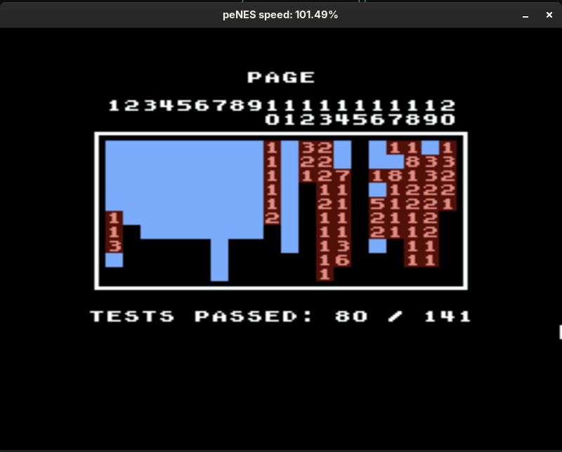
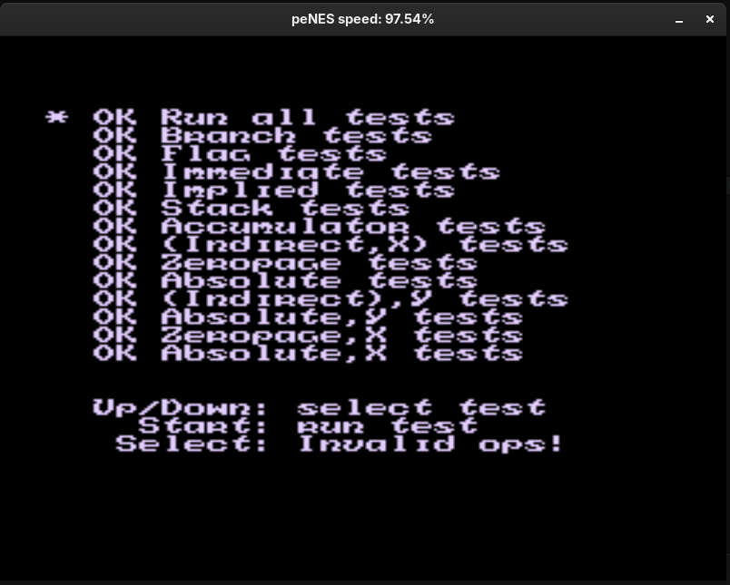
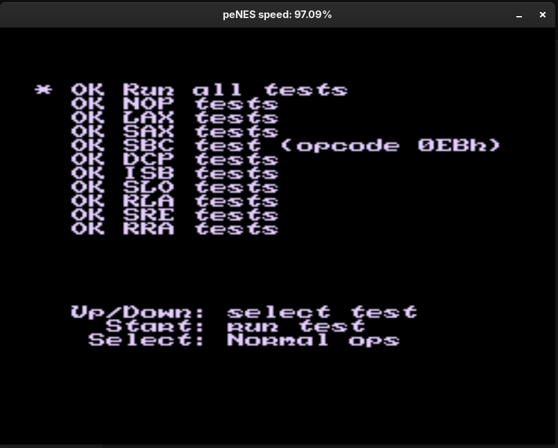
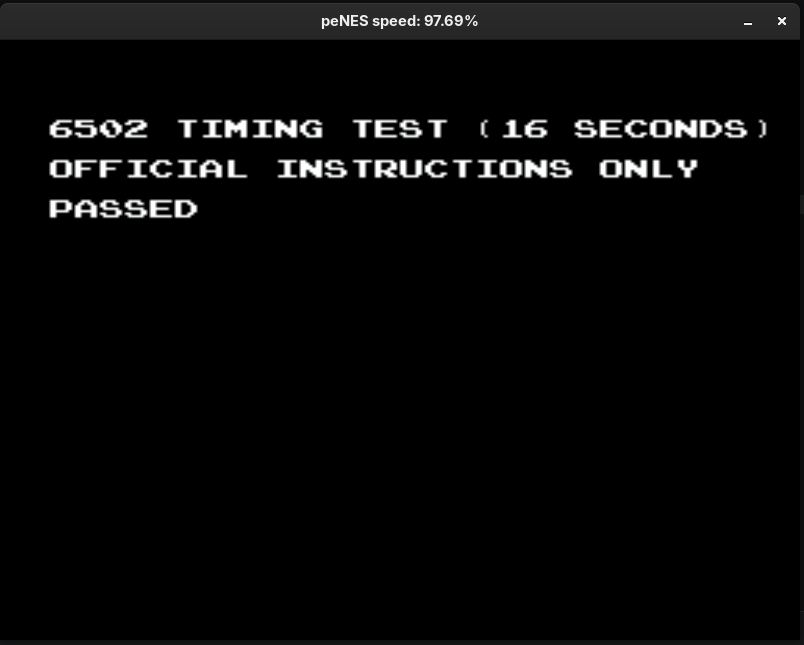

# peNES
Yet another NES emulator written in C++23.

The initial plan was to get it going within one day which I did successfully. This is my second attempt writing a NES emulator (the first one was years ago in Lua and source code is kind of lost in time). The goal was to create a working emulator in one day or less which I somewhat completed: the third commit that was made within one day was actually able to run [2048.nes](https://github.com/nwagyu/nofrendo/blob/7973653c049f5d0d19b33f9068639fcafd350059/src/2048.nes). This project was created just to have some fun and to have a handy lightweight tool with extensive control over 6502's execution flow with pretty basic programmer-friendly debugging interfaces.

> [!WARNING]
> The PPU is currently suffering around the same issues as my first emulator did because I still have to read a lot of those documentations on it to actually fix the thing.
> Also the APU is implemented but it is kind of inaccurate which could cause numerous issues in synchronization and applications execution in general. There's still a lot
> of lingering bugs yet the emulator still manages to run some games like SMB, Darkwing Duck, The Legend of Zelda, Duck Hunt and most likely way more than that. Additionally
> my CPU completely passes NEStest and 6502 timings tests, the emulator still struggless with 100thcoin's accuracy test but it passes 80/143 tests so far at the moment of me
> writing this warning.

## Screenshots
<details>
  <summary>Click to expand</summary>
	
	
	
	
	
</details>

## Implemented mappers

> [!NOTE]
> Note that "Implemented" doesn't mean "works completely flawlessly in all scenarios", a lot of games might
> straight up break because of missing or incorrectly implemented functionality inside those mappers.

- [x] MMC0
- [x] MMC1
- [ ] MMC2
- [x] MMC3
- [ ] MMC4
- [ ] MMC5
- [x] CNROM

Currently any attempt to run other mappers will result in exception.

## Usage
Just compile and run the executable with the `*.nes` file passed as argument.

It is possible to pipe your NES files aswell. You just need to specify `-` instead of a file path and the emulator will wait for a bytestream into the `stdin`. Ultimately this allows you to run any NES file from a web-server of some sort or through netcat for example. Here's little usage tutorial:
```bash
curl -L http://127.0.0.1:8486/path/to/a/totally/legal/storage/of/manually/dumped/roms/smb.nes | ./peNES -
```
> [!NOTE]
> Note that this approach DOES NOT support archived files! The incoming bytestream supposed to start with the `NES\x1A` magic!
> If you want to to run a compressed rom, you have to pipe it through the decompression utility first.

### Supported arguments
* `--volume [0...1]` - Set the master volume for the emulator, defaults to `0.3`
* `--hook [string]` - Set one of built-in CPU hooks, defaults to `null`. Possible values: `verbosetest`, `heatmap`, `test`, `used`. For details see [cpuhooks.cpp](./src/cpuhooks.cpp)
* `--skipvalid` - Skip NES dump validation and try to run it anyways, the game might run into even more issues than usual if it's fails the validation

Currently the emulator supports only Unix-like systems, it was tested on Arch Linux only so far.

### Controls
On gamepad you can use DPAD to navigate, A/B buttons to make actions, Y to cause CPU to reset, Select/Start to pick options. LB/RB to save/restore current enulation state.

Keyboard bindings:
* Escape - Reset CPU
* Arrows - Navigate
* Z/X - Action buttons
* Space/Enter - Select/Start options buttons
* S/R - Save/Restore current emulation state
* F1 - Set heatmap printing threshold to 1
* F2 - Set heatmap printing threshold to 10
* F3 - Set heatmap printing threshold to 100

## Dependencies
* SDL3 (optional, headless run is possible)

## AI usage disclosure
AI was used extensively to consult about NES' PPU and mappers architecture and summarize documentations. All the main architectural decisions, algorithms were made by me.
