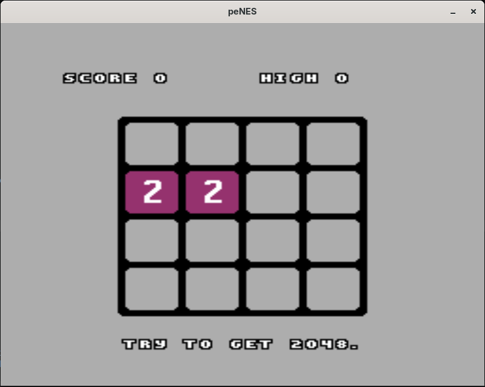

# peNES
Yet another NES emulator written in C++23.

The initial plan was to get it going within one day which I did successfully. This is my second attempt writing a NES emulator (the first one was years ago in Lua and source code is kind of lost in time). The goal was to create a working emulator in one day or less which I somewhat completed: the third commit that was made within one day was actually able to run [2048.nes](https://github.com/nwagyu/nofrendo/blob/7973653c049f5d0d19b33f9068639fcafd350059/src/2048.nes). This project was created just to have some fun and to have a handy lightweight tool with extensive control over 6502's execution flow with pretty basic programmer-friendly debugging interfaces.

> [!WARNING]  
> The PPU is currently suffering around the same issues as my first emulator did because I still have to read a lot of those documentations on it to actually fix the thing.
> Also the APU is completely missing which could cause numerous issues in synchronization and applications execution in general.
> CPU is egregiously inaccurate too, it has a lot of lingering bugs yet still manages to run some games like SMB and Duck Hunt.

## Screenshots

## Implemented mappers
- [x] MMC0
- [x] MMC1
- [ ] MMC2
- [ ] MMC3
- [ ] MMC4
- [ ] MMC5

Currently any attempt to run other mappers will result in exception.

## Usage
Just compile and run the executable with the `*.nes` file passed as first argument.

Currently the emulator supports only Unix-like systems, it was tested on Arch Linux only so far.

### Controls
On gamepad you can use DPAD to navigate, A/B buttons to make actions, Y to cause CPU to reset, Select/Start to pick options

Keyboard bindings:
* Escape - Reset CPU
* Arrows - Navigate
* Z/X - Action buttons
* Space/Enter - Select/Start options buttons

## Dependencies
* SDL3 (optional, headless run is possible)

## AI usage disclosure
AI was used extensively to consult about NES' PPU and mappers architecture and summarize documentations, around 15-25% of PPU is vibe-coded (to save some time on tedious tasks) under my supervision, no code is left untouched by human hands. The rest of main architectural decisions, algorithms was made by me.
